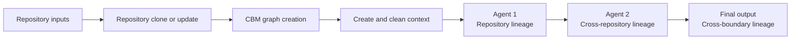
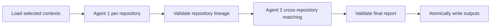

# CBM-MCP Multi-Agent Codebase Lineage

This project presents a multi-agent data-lineage solution for discovering how
data is created, transformed, persisted, and exchanged across independent
applications. It brings repository acquisition, code intelligence,
evidence preparation, repository-level analysis, and cross-application
correlation together in one reproducible workflow.

At its foundation, the solution uses Codebase Memory through the CBM-MCP layer
to convert each codebase into a queryable graph of components, relationships,
and supporting source evidence. That graph is processed and refined into a
compact, cleaned lineage context designed specifically for reliable AI-agent
analysis.

Agent 1 turns the curated context into canonical lineage for each repository.
Agent 2 then joins compatible runtime boundaries across those repository
outputs, producing an evidence-backed view of application-to-application data
movement and the final cross-boundary lineage report.

## Lineage workflow



## Prerequisites

- Python 3.10 or newer
- Git
- Internet access for installing CBM and cloning repositories

## Installation

Create and activate a project virtual environment:

```bash
python3 -m venv .venv
source .venv/bin/activate
```

Install all Python dependencies and the CBM command-line package:

```bash
python3 -m pip install --upgrade pip
python3 -m pip install -r requirements.txt
```

The `codebase-memory-mcp` PyPI package installs the command wrapper. On its first invocation, the wrapper downloads and caches the native CBM binary for the current operating system.

Verify the installation:

```bash
"$PWD/.venv/bin/codebase-memory-mcp" --version
```

## Path configuration

Copy the committed example to create your local path configuration:

```bash
cp .env.example .env
```

All project paths are configured in the local `.env` file:

| Variable | Purpose |
|---|---|
| `PROJECT_DIR` | Root of this project |
| `CBM_CACHE_DIR` | Active CBM SQLite graph databases and CBM configuration |
| `REPO_LIST_FILE` | CSV file containing repository URLs and clone statuses |
| `CLONE_DIR` | Directory where repositories are cloned |
| `CODEBASE_MEMORY_MCP_BIN` | CBM executable installed in the virtual environment |
| `CBM_ALLOWED_ROOT` | Restricts CBM indexing to the local clone directory |
| `LINEAGE_CONTEXT_DIR` | Generated per-repository evidence packages for Agent 1 |
| `GROQ_API_KEY` | Groq API key used by the LangGraph agent pipeline |
| `AGENT1_MODEL` | Agent 1 model ID; defaults to `openai/gpt-oss-120b` |
| `AGENT1_REASONING_EFFORT` | Agent 1 reasoning level; defaults to `low` |
| `AGENT2_MODEL` | Agent 2 model ID; defaults to `openai/gpt-oss-120b` |
| `AGENT2_REASONING_EFFORT` | Agent 2 reasoning level; defaults to `medium` |

The committed `.env.example` uses paths relative to the project root. The local
`.env` file is ignored by Git, so it can be changed to absolute or machine-specific
paths without committing them. Values already exported in the shell take
precedence over values in `.env`.

CBM permits only one active canonical cache root for an account at a time. Stop any running CBM daemon or active CBM commands before changing `CBM_CACHE_DIR`.

## Select repositories

Edit `git_repo_list.csv` and add one repository URL per row. Leave all status columns empty for a new entry:

```csv
repo_url,CloneStatus,IndexStatus,ContextStatus
https://github.com/spring-petclinic/spring-petclinic-rest.git,,,
https://github.com/example/another-repository.git,,,
```

The scripts maintain these status values:

| Column | Status | Meaning |
|---|---|---|
| `CloneStatus` | `cloned` | Repository was cloned for the first time, or an existing clone was verified when it had no prior status |
| `CloneStatus` | `cloned again` | New remote commits were found after the repository's earlier version had already been indexed |
| `IndexStatus` | `YetToStart` | Repository is new or changed and needs to be indexed |
| `IndexStatus` | `Indexed` | CBM indexing completed successfully for the current clone |
| `ContextStatus` | empty | The current indexed repository still needs a lineage context export |
| `ContextStatus` | `Contexted` | All lineage context files were written successfully for the current index |

## Run the preparation workflow

Run all three preparation phases—repository clone or update, CBM graph
creation, and lineage-context creation—with:

```bash
python3 main.py
```

The indexing phase starts only if cloning completes without errors. The context
phase then exports every indexed repository whose `ContextStatus` is empty or
whose `CloneStatus` is `cloned again`. Run Agent 1 and Agent 2 after these three
phases complete.

## Run preparation steps separately

### Step 1: Clone or update repositories

With the virtual environment active, run:

```bash
python3 -m lib.clone_repos
```

For an existing clone, the script fetches `origin` and compares the local commit with the tracked remote branch. It updates the clone only when a clean fast-forward is possible. It never discards local modifications or resolves diverged history automatically.

Every new clone or successful remote update resets `IndexStatus` to `YetToStart` and clears `ContextStatus`. If indexing was already pending, a remote update keeps `CloneStatus` as `cloned`; there is still only one pending initial index. If the earlier version was already indexed, a remote update changes `CloneStatus` to `cloned again`. If a repository is already current, its existing statuses are preserved. Failures are reported after every CSV entry has been attempted.

### Step 2: Create the CBM graph indexes

After cloning finishes successfully, run indexing separately:

```bash
python3 -m lib.index_repos
```

Only rows with a ready `CloneStatus`, an `IndexStatus` of `YetToStart`, and a valid local Git checkout are indexed. Successful indexing changes `IndexStatus` to `Indexed` and clears `ContextStatus`; unchanged rows already marked `Indexed` are skipped. CBM 0.8.1 derives each project name from its absolute repository path, and the active graph index is stored in `.cbm-cache/`.

### Step 3: Create and clean the lineage context

After a repository has `IndexStatus=Indexed`, export its graph and graph-selected source evidence:

```bash
python3 -m lib.export_lineage_context --repo crypto-kaka-rag
```

After every context file is written successfully, the repository's `ContextStatus` is changed to `Contexted`. A failed export leaves the previous context status unchanged.

To export every pending repository without running clone and index phases, run:

```bash
python3 -m lib.export_lineage_context --all-pending
```

After a refreshed repository is exported successfully, its `CloneStatus` changes from `cloned again` back to `cloned`. Repositories that are not yet `Indexed` are skipped and retain their pending statuses.

The pilot export is written under `lineage_context/crypto-kaka-rag/`. CBM node labels, node metadata, and relationships select candidate symbols; exact source is then retrieved through each symbol's qualified name. This graph-first path is language-neutral and does not run regular-expression searches by default. Test, generated, dependency, and CI files are excluded from the compact Agent 1 context. Empty JSON attributes and redundant CBM `Module` records are also removed; data, schema, and configuration modules are represented in `artifacts.json`, while source modules are represented by retrieved source files. The exporter verifies its raw query counts against the CBM graph schema before writing the selected context.

Static CBM queries, graph allowlists, artifact extensions, limits, selection rules, and context limitations are maintained separately in `config/lineage_context_config.py`.

If the graph does not model an important boundary, explicitly enable the optional text fallback:

```bash
python3 -m lib.export_lineage_context --repo crypto-kaka-rag --enable-text-fallback
```

Fallback searches are configured in `config/lineage_fallback_search_queries.json` and are labeled separately in `source-evidence.json`. Graph relationships remain discovery evidence; source excerpts provide the assignments, configuration, SQL, schemas, and serialization needed to confirm lineage.

## Agent 1: Repository lineage

Run Agent 1 once for each repository after its context has been created. Pass
`prompts/agent1_repository_lineage.agent.md` as the agent or system prompt and
provide the repository-specific paths in the task message:

```text
Use lineage_context/<repository-name>/context.json as the only lineage-context input.
Write the output to lineage_output/<repository-name>/repo-lineage.json.
Follow only the supplied agent instructions and do not read other files.
```

Agent 1 validates its result and produces the canonical `repo-lineage.json`
used by the next stage.

## Agent 2: Cross-repository lineage

Run Agent 2 after Agent 1 has produced `repo-lineage.json` for every intended
repository. Pass `prompts/agent2_cross_repository_lineage.agent.md` as the agent
or system prompt and provide the input and output locations in the task message:

```text
Use lineage_output/ as the input directory.
Write the output to lineage_output/cross-boundary-lineage.md.
Follow only the supplied agent instructions and do not read other files.
```

Agent 2 validates the direct application-to-application matches and produces
the final cross-boundary lineage report.

## Run the LangGraph multi-agent pipeline

The automated pipeline uses LangChain's `ChatGroq` integration and the
LangGraph-specific prompts in
`prompts/agent1_repository_lineage_langgraph.agent.md` and
`prompts/agent2_cross_repository_lineage_langgraph.agent.md`. These prompts
accept content directly from graph state and contain no file input or output
instructions. By default, both agents use `openai/gpt-oss-120b`; Agent 1 uses
low reasoning and Agent 2 uses medium reasoning. Add your Groq API key to `.env`,
then select the exact repository contexts for one run:

```bash
python3 -m lib.langgraph_lineage_pipeline \
  --repo repository-a \
  --repo repository-b
```

To explicitly process every immediate `lineage_context/*/context.json` input,
use:

```bash
python3 -m lib.langgraph_lineage_pipeline --all-repositories
```

The LangGraph flow is:



Only Agent 1 outputs created in the current run are passed to Agent 2; existing
files under `lineage_output/` are not scanned. Oversized contexts are split into
bounded evidence batches and consolidated into one validated repository output.
The pipeline writes `repo-lineage.json` for each selected repository and
`lineage_output/cross-boundary-lineage.md` only after both validation gates pass.
Groq account limits and billing apply to model calls.

## Optional: Render Agent 1 output as Markdown

After Agent 1 creates and validates a repository's `repo-lineage.json`, generate
the corresponding Markdown file from that JSON:

```bash
python3 lib/render_repository_lineage.py \
  lineage_output/crypto-kaka-rag/repo-lineage.json
```

By default, the command writes `repo-lineage.md` beside the input JSON file.

## Query the indexes

Load the same environment used during indexing:

```bash
set -a
source .env
set +a
```

List indexed projects:

```bash
"$CODEBASE_MEMORY_MCP_BIN" cli list_projects
```

Copy the exact project name returned by `list_projects`, then inspect its schema and architecture:

```bash
PROJECT_NAME="paste-the-exact-project-name-here"
"$CODEBASE_MEMORY_MCP_BIN" cli get_graph_schema "{\"project\":\"$PROJECT_NAME\"}"
"$CODEBASE_MEMORY_MCP_BIN" cli get_architecture "{\"project\":\"$PROJECT_NAME\"}"
```

CBM 0.8.1 accepts each tool's arguments as one JSON object, as shown above. The same `CBM_CACHE_DIR` must be used for both indexing and querying. The databases in `.cbm-cache/` are the active indexes; a repository's optional `.codebase-memory/graph.db.zst` persistence artifact is a separate portable bootstrap artifact.

## Generated directories

```text
.cbm-cache/       Active CBM SQLite indexes and logs
.venv/            Python virtual environment and installed CBM wrapper
repo_local_clone/ Cloned source repositories
lineage_context/  Cleaned per-repository inputs for Agent 1
lineage_output/   Agent 1 JSON outputs and the Agent 2 final report
```

These directories can be regenerated and normally should not be committed to Git.

## Multi Agent pipeline creation

The included LangGraph runner provides the first automated implementation. The
same agents remain model- and runtime-portable: pass each `.agent.md` file as the
system prompt and pass its exact authorized inputs, context, and output location
in the task message.

Future work can add an independent evaluator agent that:

- compares each Agent 1 context with its `repo-lineage.json`;
- compares the Agent 2 repository inputs with `cross-boundary-lineage.md`; and
- reports unsupported mappings, missing connections, and incorrect confidence.
