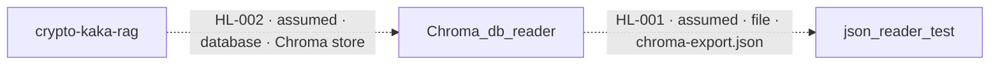

# Cross-Repository Data Lineage

Repositories analyzed: Chroma_db_reader, crypto-kaka-rag, json_reader_test, spring-petclinic-rest
Repository inputs: 5
Cross-repository connections: 2

## Application-to-Application Lineage

| Flow ID | Source Application | Target Application | Mechanism | Operation | Shared Boundary | Data Summary | Confidence | Assumption | Issues |
|---|---|---|---|---|---|---|---|---|---|
| HL-001 | Chroma_db_reader | json_reader_test | file | write → read | file://{working_directory}/chroma-export.json ⇢ file:///Users/guttikonda/Desktop/training%20docs/chroma_db_reader/chroma-export.json | records[].document + records[].metadata.{asset,time} → rows[].{btc_price,timestamp} | partial | Yes — relative chroma-export.json is assumed to be the absolute chroma_db_reader/chroma-export.json input | Chroma_db_reader:ISS-002; Chroma_db_reader:ISS-003; Agent 2: absolute file equivalence and metadata subfield compatibility are not directly proven. |
| HL-002 | crypto-kaka-rag | Chroma_db_reader | database | add → query | chromadb:./chroma_db/market_insights ⇢ sqlite:///Users/guttikonda/Desktop/training%20docs/crypto-kafka-rag-project/crypto_chroma_db | market_insights.{documents[],ids[],metadatas[].asset,metadatas[].time} → payload.records[].{document,id,metadata} | partial | Yes — logical ./chroma_db/market_insights is assumed to reside in the physical crypto_chroma_db Chroma store | crypto-kaka-rag:ISS-001; Chroma_db_reader:ISS-001; Chroma_db_reader:ISS-003; Agent 2: logical collection-to-physical SQLite equivalence and storage encoding are not directly proven. |

## Detailed Data Flow

| Detail ID | Flow ID | Source Application | Source Contract / Flow | Source Data Element(s) | Source Type | Source Raw / Normalized Locator | Mechanism | Operation | Transformation Chain | Target Application | Target Contract / Flow | Target Data Element | Target Type | Target Raw / Normalized Locator | Confidence | Assumption | Evidence | Issues |
|---|---|---|---|---|---|---|---|---|---|---|---|---|---|---|---|---|---|---|
| DF-001 | HL-001 | Chroma_db_reader | Chroma_db_reader:CTR-002 / Chroma_db_reader:FL-002 | Chroma_db_reader:EL-022: records[].metadata | object | chroma-export.json / file://{working_directory}/chroma-export.json | file | write → read | Chroma_db_reader:FL-002 serializes payload.records[].metadata as records[].metadata → assumed same chroma-export.json → json_reader_test:FL-001 retains metadata.time only when metadata.asset identifies BTC | json_reader_test | json_reader_test:CTR-001 / json_reader_test:FL-001 | json_reader_test:EL-004: rows[].timestamp | unknown | /Users/guttikonda/Desktop/training docs/chroma_db_reader/chroma-export.json / file:///Users/guttikonda/Desktop/training%20docs/chroma_db_reader/chroma-export.json | partial | Yes — relative chroma-export.json is assumed to be the absolute chroma_db_reader/chroma-export.json input; metadata.asset and metadata.time are assumed to be members of the emitted metadata object | Chroma_db_reader:EV-014; Chroma_db_reader:EV-018; json_reader_test:EV-005; json_reader_test:EV-007; json_reader_test:EV-009 | Chroma_db_reader:ISS-002; Chroma_db_reader:ISS-003; Agent 2: the source metadata keys and scalar types are not enumerated, and the absolute file location is unresolved. |
| DF-002 | HL-001 | Chroma_db_reader | Chroma_db_reader:CTR-002 / Chroma_db_reader:FL-002 | Chroma_db_reader:EL-021: records[].document Chroma_db_reader:EL-022: records[].metadata | unknown; object | chroma-export.json / file://{working_directory}/chroma-export.json | file | write → read | Chroma_db_reader:FL-002 serializes payload document and metadata → assumed same chroma-export.json → json_reader_test:FL-001 filters on metadata.asset = BTC and applies PRICE_PATTERN.search(document).group(1) | json_reader_test | json_reader_test:CTR-001 / json_reader_test:FL-001 | json_reader_test:EL-005: rows[].btc_price | string | /Users/guttikonda/Desktop/training docs/chroma_db_reader/chroma-export.json / file:///Users/guttikonda/Desktop/training%20docs/chroma_db_reader/chroma-export.json | partial | Yes — relative chroma-export.json is assumed to be the absolute chroma_db_reader/chroma-export.json input; records[].metadata.asset is assumed to be present in the emitted metadata object | Chroma_db_reader:EV-014; Chroma_db_reader:EV-018; json_reader_test:EV-002; json_reader_test:EV-005; json_reader_test:EV-006; json_reader_test:EV-007; json_reader_test:EV-009 | Chroma_db_reader:ISS-002; Chroma_db_reader:ISS-003; Agent 2: the source document scalar type and metadata.asset subfield are not proven by the source contract. |
| DF-003 | HL-002 | crypto-kaka-rag | crypto-kaka-rag:CTR-004 / crypto-kaka-rag:FL-004 | crypto-kaka-rag:EL-020: market_insights.documents[] | string | ./chroma_db / market_insights / chromadb:./chroma_db/market_insights | database | add → query | crypto-kaka-rag:FL-004 formats asset, timestamp, price, volume_24h, and change_24h into market_insights.documents[] → assumed Chroma logical-document persistence to embedding_metadata.key/string_value → Chroma_db_reader:FL-001 aggregates the chroma:document value into payload.records[].document | Chroma_db_reader | Chroma_db_reader:CTR-001 / Chroma_db_reader:FL-001 | Chroma_db_reader:EL-017: payload.records[].document | unknown | /Users/guttikonda/Desktop/training docs/crypto-kafka-rag-project/crypto_chroma_db / sqlite:///Users/guttikonda/Desktop/training%20docs/crypto-kafka-rag-project/crypto_chroma_db | partial | Yes — logical ./chroma_db/market_insights is assumed to reside in the physical crypto_chroma_db store, with documents encoded in Chroma's internal metadata rows | crypto-kaka-rag:EV-011; crypto-kaka-rag:EV-012; crypto-kaka-rag:EV-014; Chroma_db_reader:EV-003; Chroma_db_reader:EV-005; Chroma_db_reader:EV-016; Chroma_db_reader:EV-017 | crypto-kaka-rag:ISS-001; Chroma_db_reader:ISS-001; Chroma_db_reader:ISS-003; Agent 2: logical documents[] to embedding_metadata storage is not directly mapped. |
| DF-004 | HL-002 | crypto-kaka-rag | crypto-kaka-rag:CTR-004 / crypto-kaka-rag:FL-004 | crypto-kaka-rag:EL-023: market_insights.ids[] | string | ./chroma_db / market_insights / chromadb:./chroma_db/market_insights | database | add → query | crypto-kaka-rag:FL-004 derives ids[] as timestamp_message-offset → assumed Chroma logical-ID persistence to embeddings.embedding_id → Chroma_db_reader:FL-001 renames embeddings.embedding_id to payload.records[].id | Chroma_db_reader | Chroma_db_reader:CTR-001 / Chroma_db_reader:FL-001 | Chroma_db_reader:EL-016: payload.records[].id | unknown | /Users/guttikonda/Desktop/training docs/crypto-kafka-rag-project/crypto_chroma_db / sqlite:///Users/guttikonda/Desktop/training%20docs/crypto-kafka-rag-project/crypto_chroma_db | partial | Yes — logical ./chroma_db/market_insights is assumed to reside in the physical crypto_chroma_db store, with ids[] persisted as embeddings.embedding_id | crypto-kaka-rag:EV-013; crypto-kaka-rag:EV-014; Chroma_db_reader:EV-003; Chroma_db_reader:EV-004; Chroma_db_reader:EV-014; Chroma_db_reader:EV-016; Chroma_db_reader:EV-017 | crypto-kaka-rag:ISS-001; Chroma_db_reader:ISS-001; Chroma_db_reader:ISS-003; Agent 2: logical ids[] to embeddings.embedding_id storage is not directly mapped. |
| DF-005 | HL-002 | crypto-kaka-rag | crypto-kaka-rag:CTR-004 / crypto-kaka-rag:FL-004 | crypto-kaka-rag:EL-021: market_insights.metadatas[].asset | string | ./chroma_db / market_insights / chromadb:./chroma_db/market_insights | database | add → query | crypto-kaka-rag:FL-004 copies row.asset to metadatas[].asset → assumed Chroma typed metadata-key persistence → Chroma_db_reader:FL-001 aggregates non-chroma metadata keys into payload.records[].metadata | Chroma_db_reader | Chroma_db_reader:CTR-001 / Chroma_db_reader:FL-001 | Chroma_db_reader:EL-018: payload.records[].metadata | object | /Users/guttikonda/Desktop/training docs/crypto-kafka-rag-project/crypto_chroma_db / sqlite:///Users/guttikonda/Desktop/training%20docs/crypto-kafka-rag-project/crypto_chroma_db | partial | Yes — logical ./chroma_db/market_insights is assumed to reside in the physical crypto_chroma_db store, with metadata.asset encoded in embedding_metadata | crypto-kaka-rag:EV-011; crypto-kaka-rag:EV-014; Chroma_db_reader:EV-003; Chroma_db_reader:EV-006; Chroma_db_reader:EV-007; Chroma_db_reader:EV-008; Chroma_db_reader:EV-009; Chroma_db_reader:EV-014; Chroma_db_reader:EV-016; Chroma_db_reader:EV-017 | crypto-kaka-rag:ISS-001; Chroma_db_reader:ISS-001; Chroma_db_reader:ISS-003; Agent 2: metadata.asset's physical key/value row and scalar column are not directly mapped. |
| DF-006 | HL-002 | crypto-kaka-rag | crypto-kaka-rag:CTR-004 / crypto-kaka-rag:FL-004 | crypto-kaka-rag:EL-022: market_insights.metadatas[].time | integer | ./chroma_db / market_insights / chromadb:./chroma_db/market_insights | database | add → query | crypto-kaka-rag:FL-004 renames row.timestamp to metadatas[].time → assumed Chroma typed metadata-key persistence → Chroma_db_reader:FL-001 aggregates non-chroma metadata keys into payload.records[].metadata | Chroma_db_reader | Chroma_db_reader:CTR-001 / Chroma_db_reader:FL-001 | Chroma_db_reader:EL-018: payload.records[].metadata | object | /Users/guttikonda/Desktop/training docs/crypto-kafka-rag-project/crypto_chroma_db / sqlite:///Users/guttikonda/Desktop/training%20docs/crypto-kafka-rag-project/crypto_chroma_db | partial | Yes — logical ./chroma_db/market_insights is assumed to reside in the physical crypto_chroma_db store, with metadata.time encoded in embedding_metadata | crypto-kaka-rag:EV-011; crypto-kaka-rag:EV-014; Chroma_db_reader:EV-003; Chroma_db_reader:EV-006; Chroma_db_reader:EV-007; Chroma_db_reader:EV-008; Chroma_db_reader:EV-009; Chroma_db_reader:EV-014; Chroma_db_reader:EV-016; Chroma_db_reader:EV-017 | crypto-kaka-rag:ISS-001; Chroma_db_reader:ISS-001; Chroma_db_reader:ISS-003; Agent 2: metadata.time's physical key/value row and scalar column are not directly mapped. |

## Application Flow Diagram

