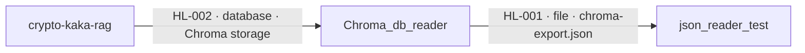

# Cross-Repository Data Lineage

Repositories analyzed: Chroma_db_reader, crypto-kaka-rag, json_reader_test, spring-petclinic-rest
Repository inputs: 4
Cross-repository connections: 2

## Application-to-Application Lineage

| Flow ID | Source Application | Target Application | Mechanism | Operation | Shared Boundary | Data Summary | Confidence | Issues |
|---|---|---|---|---|---|---|---|---|
| HL-001 | Chroma_db_reader | json_reader_test | file | write → read | file://repo/chroma_db_reader/chroma-export.json ⇢ file:///Users/guttikonda/Desktop/training docs/chroma_db_reader/chroma-export.json | records[].document, records[].metadata.asset, records[].metadata.time | partial | Chroma_db_reader:ISS-001; source repository-relative locator differs from target absolute locator; match is supported by complementary write/read operations, the shared `chroma_db_reader/chroma-export.json` resource suffix, and compatible record schemas. |
| HL-002 | crypto-kaka-rag | Chroma_db_reader | database | insert → read | chroma://repo/crypto-kaka-rag/chroma_db/market_insights ⇢ sqlite:////users/guttikonda/desktop/training docs/crypto-kafka-rag-project/crypto_chroma_db/chroma.sqlite3 | documents[].text, ids[], metadatas[].asset, metadatas[].time | partial | Chroma_db_reader:ISS-001; the logical Chroma collection locator differs from the physical SQLite locator; match is supported by complementary insert/read operations and compatible Chroma document, embedding-ID, and typed-metadata schemas. |

## Detailed Data Flow

| Detail ID | Flow ID | Source Application | Source Contract / Flow | Source Data Element(s) | Source Type | Source Raw / Normalized Locator | Mechanism | Operation | Transformation Chain | Target Application | Target Contract / Flow | Target Data Element | Target Type | Target Raw / Normalized Locator | Confidence | Evidence | Issues |
|---|---|---|---|---|---|---|---|---|---|---|---|---|---|---|---|---|---|
| DF-001 | HL-001 | Chroma_db_reader | Chroma_db_reader:CTR-002 / Chroma_db_reader:FL-002 | Chroma_db_reader:EL-014: records[].document | string | raw: chroma-export.json normalized: file://repo/chroma_db_reader/chroma-export.json | file | write → read | serialize `records.document` into `records[].document` → exact file-field match; json_reader_test:FL-001 subsequently parses the document's price text | json_reader_test | json_reader_test:CTR-001 / json_reader_test:FL-001 | json_reader_test:EL-003: records[].document | string | raw: /Users/guttikonda/Desktop/training docs/chroma_db_reader/chroma-export.json normalized: file:///Users/guttikonda/Desktop/training docs/chroma_db_reader/chroma-export.json | partial | Chroma_db_reader:EV-003, Chroma_db_reader:EV-005, json_reader_test:EV-002 | Source and target locators differ; row confidence is also limited by Chroma_db_reader:ISS-001. |
| DF-002 | HL-001 | Chroma_db_reader | Chroma_db_reader:CTR-002 / Chroma_db_reader:FL-002 | Chroma_db_reader:EL-015: records[].metadata | object | raw: chroma-export.json normalized: file://repo/chroma_db_reader/chroma-export.json | file | write → read | serialize dynamic metadata object → select `records[].metadata.asset`; json_reader_test:FL-001 uses the field to filter for BTC | json_reader_test | json_reader_test:CTR-001 / json_reader_test:FL-001 | json_reader_test:EL-001: records[].metadata.asset | string | raw: /Users/guttikonda/Desktop/training docs/chroma_db_reader/chroma-export.json normalized: file:///Users/guttikonda/Desktop/training docs/chroma_db_reader/chroma-export.json | partial | Chroma_db_reader:EV-003, Chroma_db_reader:EV-005, json_reader_test:EV-002 | Chroma_db_reader:ISS-001 states that dynamic metadata keys and types cannot be enumerated; the locator also differs. |
| DF-003 | HL-001 | Chroma_db_reader | Chroma_db_reader:CTR-002 / Chroma_db_reader:FL-002 | Chroma_db_reader:EL-015: records[].metadata | object | raw: chroma-export.json normalized: file://repo/chroma_db_reader/chroma-export.json | file | write → read | serialize dynamic metadata object → select `records[].metadata.time`; json_reader_test:FL-001 carries the value only for BTC records | json_reader_test | json_reader_test:CTR-001 / json_reader_test:FL-001 | json_reader_test:EL-002: records[].metadata.time | unknown | raw: /Users/guttikonda/Desktop/training docs/chroma_db_reader/chroma-export.json normalized: file:///Users/guttikonda/Desktop/training docs/chroma_db_reader/chroma-export.json | partial | Chroma_db_reader:EV-003, Chroma_db_reader:EV-005, json_reader_test:EV-002 | Chroma_db_reader:ISS-001 states that dynamic metadata keys and types cannot be enumerated; the locator also differs. |
| DF-004 | HL-002 | crypto-kaka-rag | crypto-kaka-rag:CTR-004 / crypto-kaka-rag:FL-005 | crypto-kaka-rag:EL-032: documents[].text | string | raw: ./chroma_db \| collection=market_insights normalized: chroma://repo/crypto-kaka-rag/chroma_db/market_insights | database | insert → read | derive formatted document text → Chroma persistence as metadata string value keyed by `chroma:document` → Chroma_db_reader:FL-001 aggregates it as the document | Chroma_db_reader | Chroma_db_reader:CTR-001 / Chroma_db_reader:FL-001 | Chroma_db_reader:EL-004: embedding_metadata.string_value | string | raw: /Users/guttikonda/Desktop/training docs/crypto-kafka-rag-project/crypto_chroma_db/chroma.sqlite3 normalized: sqlite:////users/guttikonda/desktop/training docs/crypto-kafka-rag-project/crypto_chroma_db/chroma.sqlite3 | partial | crypto-kaka-rag:EV-009, crypto-kaka-rag:EV-011, Chroma_db_reader:EV-002 | Logical collection and physical SQLite locators differ; confidence is also limited by Chroma_db_reader:ISS-001. |
| DF-005 | HL-002 | crypto-kaka-rag | crypto-kaka-rag:CTR-004 / crypto-kaka-rag:FL-005 | crypto-kaka-rag:EL-035: ids[] | string | raw: ./chroma_db \| collection=market_insights normalized: chroma://repo/crypto-kaka-rag/chroma_db/market_insights | database | insert → read | derive ID from timestamp and message offset → Chroma embedding ID → Chroma_db_reader:FL-001 reads `e.embedding_id` | Chroma_db_reader | Chroma_db_reader:CTR-001 / Chroma_db_reader:FL-001 | Chroma_db_reader:EL-002: embeddings.embedding_id | unknown | raw: /Users/guttikonda/Desktop/training docs/crypto-kafka-rag-project/crypto_chroma_db/chroma.sqlite3 normalized: sqlite:////users/guttikonda/desktop/training docs/crypto-kafka-rag-project/crypto_chroma_db/chroma.sqlite3 | partial | crypto-kaka-rag:EV-009, crypto-kaka-rag:EV-011, Chroma_db_reader:EV-002 | Logical collection and physical SQLite locators differ; target embedding-ID type is unknown. |
| DF-006 | HL-002 | crypto-kaka-rag | crypto-kaka-rag:CTR-004 / crypto-kaka-rag:FL-005 | crypto-kaka-rag:EL-033: metadatas[].asset | string | raw: ./chroma_db \| collection=market_insights normalized: chroma://repo/crypto-kaka-rag/chroma_db/market_insights | database | insert → read | preserve `asset` in Chroma metadata → typed metadata key/value storage → Chroma_db_reader:FL-001 dynamically aggregates non-`chroma:` keys | Chroma_db_reader | Chroma_db_reader:CTR-001 / Chroma_db_reader:FL-001 | Chroma_db_reader:EL-004: embedding_metadata.string_value | string | raw: /Users/guttikonda/Desktop/training docs/crypto-kafka-rag-project/crypto_chroma_db/chroma.sqlite3 normalized: sqlite:////users/guttikonda/desktop/training docs/crypto-kafka-rag-project/crypto_chroma_db/chroma.sqlite3 | partial | crypto-kaka-rag:EV-011, Chroma_db_reader:EV-002 | Chroma_db_reader:ISS-001 prevents confirmation of the dynamic key-to-column mapping; locators also differ. |
| DF-007 | HL-002 | crypto-kaka-rag | crypto-kaka-rag:CTR-004 / crypto-kaka-rag:FL-005 | crypto-kaka-rag:EL-034: metadatas[].time | integer | raw: ./chroma_db \| collection=market_insights normalized: chroma://repo/crypto-kaka-rag/chroma_db/market_insights | database | insert → read | rename producer timestamp to metadata `time` → typed integer metadata storage → Chroma_db_reader:FL-001 dynamically aggregates non-`chroma:` keys | Chroma_db_reader | Chroma_db_reader:CTR-001 / Chroma_db_reader:FL-001 | Chroma_db_reader:EL-005: embedding_metadata.int_value | integer | raw: /Users/guttikonda/Desktop/training docs/crypto-kafka-rag-project/crypto_chroma_db/chroma.sqlite3 normalized: sqlite:////users/guttikonda/desktop/training docs/crypto-kafka-rag-project/crypto_chroma_db/chroma.sqlite3 | partial | crypto-kaka-rag:EV-011, Chroma_db_reader:EV-002 | Chroma_db_reader:ISS-001 prevents confirmation of the dynamic key-to-column mapping; locators also differ. |

## Application Flow Diagram

