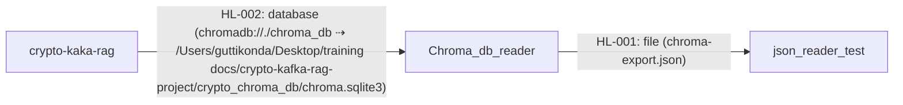

# Cross-Repository Data Lineage

Repositories analyzed: Chroma_db_reader, crypto-kaka-rag, json_reader_test
Repository inputs: 3
Cross-repository connections: 2

## Application-to-Application Lineage

| Flow ID | Source Application | Target Application | Mechanism | Operation | Shared Boundary | Data Summary | Confidence | Issues |
|---|---|---|---|---|---|---|---|---|
| HL-001 | Chroma_db_reader | json_reader_test | file | write ⇢ read | chroma-export.json | `Chroma_db_reader:EL-008` (collection), `Chroma_db_reader:EL-009` (id), `Chroma_db_reader:EL-010` (document), `Chroma_db_reader:EL-011` (metadata) ⇢ `json_reader_test:EL-001` (records) | partial | `Chroma_db_reader:CTR-003` and `json_reader_test:CTR-001` have different normalized locators (`chroma-export.json` vs `file:///Users/guttikonda/Desktop/training docs/chroma_db_reader/chroma-export.json`) and different schema signatures, requiring inference for full element mapping. |
| HL-002 | crypto-kaka-rag | Chroma_db_reader | database | add ⇢ read | `chromadb://./chroma_db` ⇢ `/Users/guttikonda/Desktop/training docs/crypto-kafka-rag-project/crypto_chroma_db/chroma.sqlite3` | `crypto-kaka-rag:EL-006` (documents), `crypto-kaka-rag:EL-007` (metadatas.asset), `crypto-kaka-rag:EL-008` (metadatas.time), `crypto-kaka-rag:EL-009` (ids) ⇢ `Chroma_db_reader:EL-001` (collections.name), `Chroma_db_reader:EL-002` (embeddings.id), `Chroma_db_reader:EL-003` (embedding_metadata.key), `Chroma_db_reader:EL-004` (embedding_metadata.string_value), `Chroma_db_reader:EL-005` (embedding_metadata.int_value) | partial | `crypto-kaka-rag:CTR-003` and `Chroma_db_reader:CTR-002` have different normalized locators and represent ChromaDB data at different abstraction levels (client API vs. raw SQLite tables), requiring inference for element mapping. |

## Detailed Data Flow

| Detail ID | Flow ID | Source Application | Source Contract / Flow | Source Data Element(s) | Source Type | Source Raw / Normalized Locator | Mechanism | Operation | Transformation Chain | Target Application | Target Contract / Flow | Target Data Element | Target Type | Target Raw / Normalized Locator | Confidence | Evidence | Issues |
|---|---|---|---|---|---|---|---|---|---|---|---|---|---|---|---|---|---|
| DF-001 | HL-001 | Chroma_db_reader | `Chroma_db_reader:FL-002` | `Chroma_db_reader:EL-010` | string | `chroma-export.json` | file | write ⇢ read | none | json_reader_test | `json_reader_test:FL-002` | `json_reader_test:EL-004` | string | `file:///Users/guttikonda/Desktop/training docs/chroma_db_reader/chroma-export.json` | partial | `Chroma_db_reader:EV-002`, `json_reader_test:EV-001` | `Chroma_db_reader:CTR-003` and `json_reader_test:CTR-001` have different normalized locators and different schema signatures, requiring inference for full element mapping. |
| DF-002 | HL-001 | Chroma_db_reader | `Chroma_db_reader:FL-002` | `Chroma_db_reader:EL-011` | json | `chroma-export.json` | file | write ⇢ read | extract | json_reader_test | `json_reader_test:FL-002` | `json_reader_test:EL-002` | string | `file:///Users/guttikonda/Desktop/training docs/chroma_db_reader/chroma-export.json` | partial | `Chroma_db_reader:EV-002`, `json_reader_test:EV-001` | `Chroma_db_reader:CTR-003` and `json_reader_test:CTR-001` have different normalized locators and different schema signatures, requiring inference for full element mapping. |
| DF-003 | HL-001 | Chroma_db_reader | `Chroma_db_reader:FL-002` | `Chroma_db_reader:EL-011` | json | `chroma-export.json` | file | write ⇢ read | extract | json_reader_test | `json_reader_test:FL-002` | `json_reader_test:EL-003` | string | `file:///Users/guttikonda/Desktop/training docs/chroma_db_reader/chroma-export.json` | partial | `Chroma_db_reader:EV-002`, `json_reader_test:EV-001` | `Chroma_db_reader:CTR-003` and `json_reader_test:CTR-001` have different normalized locators and different schema signatures, requiring inference for full element mapping. |
| DF-004 | HL-002 | crypto-kaka-rag | `crypto-kaka-rag:FL-004` | `crypto-kaka-rag:EL-006` | string | `chromadb://./chroma_db` | database | add ⇢ read | none | Chroma_db_reader | `Chroma_db_reader:FL-001` | `Chroma_db_reader:EL-004` | string | `/Users/guttikonda/Desktop/training docs/crypto-kafka-rag-project/crypto_chroma_db/chroma.sqlite3` | partial | `crypto-kaka-rag:EV-002`, `Chroma_db_reader:EV-002` | `crypto-kaka-rag:CTR-003` and `Chroma_db_reader:CTR-002` have different normalized locators and represent ChromaDB data at different abstraction levels (client API vs. raw SQLite tables), requiring inference for element mapping. |
| DF-005 | HL-002 | crypto-kaka-rag | `crypto-kaka-rag:FL-004` | `crypto-kaka-rag:EL-007` | string | `chromadb://./chroma_db` | database | add ⇢ read | none | Chroma_db_reader | `Chroma_db_reader:FL-001` | `Chroma_db_reader:EL-004` | string | `/Users/guttikonda/Desktop/training docs/crypto-kafka-rag-project/crypto_chroma_db/chroma.sqlite3` | partial | `crypto-kaka-rag:EV-002`, `Chroma_db_reader:EV-002` | `crypto-kaka-rag:CTR-003` and `Chroma_db_reader:CTR-002` have different normalized locators and represent ChromaDB data at different abstraction levels (client API vs. raw SQLite tables), requiring inference for element mapping. |
| DF-006 | HL-002 | crypto-kaka-rag | `crypto-kaka-rag:FL-004` | `crypto-kaka-rag:EL-008` | integer | `chromadb://./chroma_db` | database | add ⇢ read | none | Chroma_db_reader | `Chroma_db_reader:FL-001` | `Chroma_db_reader:EL-005` | integer | `/Users/guttikonda/Desktop/training docs/crypto-kafka-rag-project/crypto_chroma_db/chroma.sqlite3` | partial | `crypto-kaka-rag:EV-002`, `Chroma_db_reader:EV-002` | `crypto-kaka-rag:CTR-003` and `Chroma_db_reader:CTR-002` have different normalized locators and represent ChromaDB data at different abstraction levels (client API vs. raw SQLite tables), requiring inference for element mapping. |
| DF-007 | HL-002 | crypto-kaka-rag | `crypto-kaka-rag:FL-004` | `crypto-kaka-rag:EL-009` | string | `chromadb://./chroma_db` | database | add ⇢ read | none | Chroma_db_reader | `Chroma_db_reader:FL-001` | `Chroma_db_reader:EL-002` | string | `/Users/guttikonda/Desktop/training docs/crypto-kafka-rag-project/crypto_chroma_db/chroma.sqlite3` | partial | `crypto-kaka-rag:EV-002`, `Chroma_db_reader:EV-002` | `crypto-kaka-rag:CTR-003` and `Chroma_db_reader:CTR-002` have different normalized locators and represent ChromaDB data at different abstraction levels (client API vs. raw SQLite tables), requiring inference for element mapping. |

## Application Flow Diagram

