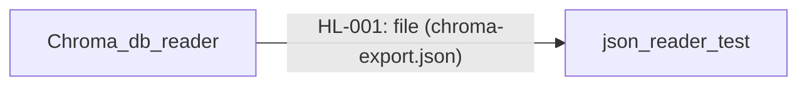

# Cross-Repository Data Lineage

Repositories analyzed: Chroma_db_reader, crypto-kaka-rag, json_reader_test
Repository inputs: 3
Cross-repository connections: 1

## Application-to-Application Lineage

| Flow ID | Source Application | Target Application | Mechanism | Operation | Shared Boundary | Data Summary | Confidence | Issues |
|---|---|---|---|---|---|---|---|---|
| HL-001 | Chroma_db_reader | json_reader_test | file | write ⇢ read | file:///Users/guttikonda/Desktop/training docs/chroma_db_reader/chroma-export.json | collection, id, document, metadata ⇢ records.metadata.asset, records.metadata.time, records.document.price | confirmed | — |

## Detailed Data Flow

| Detail ID | Flow ID | Source Application | Source Contract / Flow | Source Data Element(s) | Source Type | Source Raw / Normalized Locator | Mechanism | Operation | Transformation Chain | Target Application | Target Contract / Flow | Target Data Element | Target Type | Target Raw / Normalized Locator | Confidence | Evidence | Issues |
|---|---|---|---|---|---|---|---|---|---|---|---|---|---|---|---|---|---|
| DF-001 | HL-001 | Chroma_db_reader | Chroma_db_reader:FL-001 | Chroma_db_reader:EL-001 | string | /Users/guttikonda/Desktop/training docs/crypto-kafka-rag-project/crypto_chroma_db/chroma.sqlite3 | file | write ⇢ read | rename: c.name AS collection_name -> collection | json_reader_test | json_reader_test:FL-001 | json_reader_test:EL-003 | string | /Users/guttikonda/Desktop/training docs/chroma_db_reader/chroma-export.json | confirmed | Chroma_db_reader:EV-002, json_reader_test:EV-004 | — |
| DF-002 | HL-001 | Chroma_db_reader | Chroma_db_reader:FL-001 | Chroma_db_reader:EL-002 | string | /Users/guttikonda/Desktop/training docs/crypto-kafka-rag-project/crypto_chroma_db/chroma.sqlite3 | file | write ⇢ read | rename: e.embedding_id -> id | json_reader_test | json_reader_test:FL-001 | json_reader_test:EL-009 | string | /Users/guttikonda/Desktop/training docs/chroma_db_reader/chroma-export.json | confirmed | Chroma_db_reader:EV-002, json_reader_test:EV-002 | — |
| DF-003 | HL-001 | Chroma_db_reader | Chroma_db_reader:FL-001 | Chroma_db_reader:EL-004 | string | /Users/guttikonda/Desktop/training docs/crypto-kafka-rag-project/crypto_chroma_db/chroma.sqlite3 | file | write ⇢ read | filter: MAX(CASE WHEN em.key = 'chroma:document' THEN em.string_value END) AS document | json_reader_test | json_reader_test:FL-001 | json_reader_test:EL-005 | string | /Users/guttikonda/Desktop/training docs/chroma_db_reader/chroma-export.json | confirmed | Chroma_db_reader:EV-002, json_reader_test:EV-006 | — |
| DF-004 | HL-001 | Chroma_db_reader | Chroma_db_reader:FL-001 | Chroma_db_reader:EL-003, Chroma_db_reader:EL-004, Chroma_db_reader:EL-005, Chroma_db_reader:EL-006, Chroma_db_reader:EL-007 | string, string, integer, float, boolean | /Users/guttikonda/Desktop/training docs/crypto-kafka-rag-project/crypto_chroma_db/chroma.sqlite3 | file | write ⇢ read | aggregate: json_group_object(em.key, CASE WHEN em.string_value IS NOT NULL THEN em.string_value ... END) FILTER (WHERE em.key NOT LIKE 'chroma:%') AS metadata | json_reader_test | json_reader_test:FL-001 | json_reader_test:EL-002 | dict | /Users/guttikonda/Desktop/training docs/chroma_db_reader/chroma-export.json | confirmed | Chroma_db_reader:EV-002, json_reader_test:EV-003 | — |

## Application Flow Diagram

